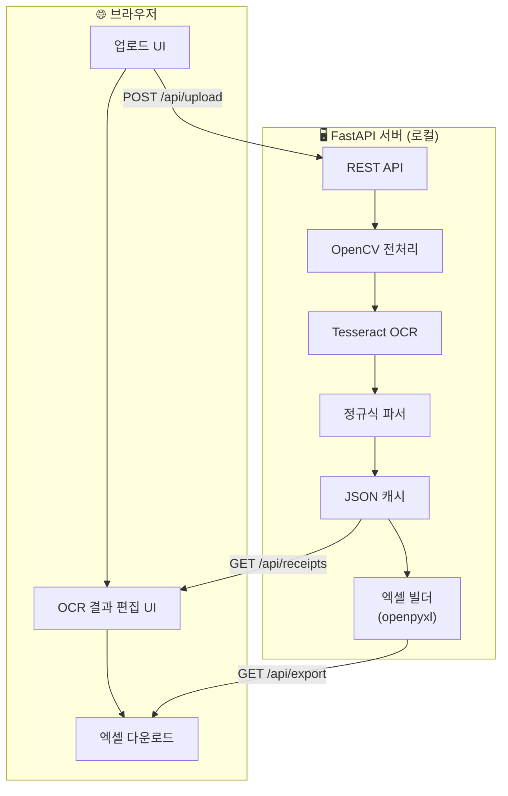

# PRD: 심천지사 중국 영수증 OCR → 엑셀 변환 웹앱

> **문서 버전**: v1.1 (리뷰 반영)  
> **작성일**: 2026-06-30  
> **프로젝트 코드명**: `SROT` (Shenzhen Receipt OCR Transformer)  
> **작업 경로**: `C:\Users\20000177\Desktop\Wooktigravity\260630_shenzhen_restart_step_1`

---

## 1. 배경 및 문제 정의

### 1.1 현재 업무 플로우 (AS-IS)

| 문제점 | 영향 |
|--------|------|
| 영수증 1건당 6개 필드를 수기 입력 | 월 50~60건 × 10분 = **약 8~10시간 소요** |
| 중국어 发票(Fapiao) 판독 어려움 | 금액·날짜 오기입 빈발 |
| 대/소계정 분류 기준 혼동 | 계정과목 오분류 → 정산 반려 |
| 증빙번호↔스캔본 수동 대조 | 누락·중복 발생 |

### 1.2 목표 (TO-BE)

---

## 2. 핵심 원칙 및 제약 조건

> [!IMPORTANT]
> 1. **LLM API 사용 금지** — GPT, Gemini, Claude 등 유료/무료 LLM API 일절 불가
> 2. **외부 API 호출 금지** — Google Vision, Azure OCR 등 클라우드 OCR 서비스 불가
> 3. **100% 로컬 실행** — 인터넷 미연결 환경에서도 완전 동작 보장
> 4. **관리 엑셀 양식 준수** — `26년_6월 심천지사 전도금 정산(데이터 양식 변경).xlsx` 양식 기준
> 5. **OpenCV 고급 전처리 필수** — 중국 영수증 특성상 기울기 보정, 원근 변환, 이진화 등 적용

---

## 3. 기능 요구사항

### 3.1 Phase 1: MVP (즉시 착수)

| ID | 기능 | 상세 |
|----|------|------|
| **F1** | 영수증 이미지 업로드 | 드래그&드롭, 파일 선택, JPG/PNG/PDF/HEIC, 다중 업로드(최대 50장) |
| **F2** | OpenCV 고급 이미지 전처리 | 그레이스케일, Otsu 이진화, 노이즈 제거, 기울기 보정(Hough), 원근 변환 |
| **F3** | OCR 텍스트 추출 | Tesseract `eng+chi_sim`, 이미지 해시 기반 캐싱 |
| **F4** | 구조화 데이터 파싱 | 정규식 기반 날짜/금액/판매자/내역/유형 자동 추출 |
| **F5** | OCR 결과 검토·수정 UI | 좌:이미지 뷰어(확대/회전) / 우:편집 폼(계정 드롭다운) |
| **F6** | 엑셀 내보내기 | 관리 양식 매핑, 수식 자동 생성, `.xlsx` 다운로드 |

### 3.2 Phase 2: 확장 기능 (후속)

| ID | 기능 | 우선순위 |
|----|------|----------|
| F7 | 영수증 유형별 자동 계정 분류 | 높음 |
| F8 | 증빙번호 자동 채번 + HYPERLINK | 높음 |
| F9 | 중복 영수증 탐지 | 중간 |
| F10 | 교통비 대장 / 기사 야근 일지 연동 | 중간 |
| F11 | PDF 증빙 자료집 자동 병합 | 낮음 |

---

## 4. 관리 엑셀 양식 매핑 규격

> [!NOTE]
> **기준 양식**: `26년_6월 심천지사 전도금 정산(데이터 양식 변경).xlsx` → `26.06` 시트

### 4.1 열 구조 (행 19~20 헤더 기준)

| 열 | 행19 헤더 | 행20 헤더 | OCR 매핑 소스 |
|----|-----------|-----------|---------------|
| B | 날짜 | 출금일자 | OCR 추출 날짜 |
| C | — | 증빙일자 | OCR 추출 개표일 |
| D | — | 증빙번호(뒤5자리) | 증빙번호 참조 |
| E | 내역 | 내역 | OCR 추출 내역 + 수정 |
| F | 담당자 | 담당자 | 드롭다운 선택 |
| G | 증빙번호 | 증빙번호 | 자동 채번 |
| H | 대계정 | 대계정 | 자동 분류 + 수정 |
| I | 소계정 | 소계정 | 자동 분류 + 수정 |
| J~L | 입금 | CNY / 환산요율 / USD | — |
| M~O | 출금 | CNY / 환산요율 / USD | OCR 금액 → M열 |
| P~Q | 잔액 | CNY / USD | 수식 자동 계산 |

### 4.2 계정과목 체계

| 계정코드 | 대계정 | 소계정 | 해당 지출 유형 |
|----------|--------|--------|----------------|
| 51131050 | 업무추진비 | 일반 | 업무 접대비 |
| 51061030 | 여비교통비 | 해외 | 출장비, 교통비, 주유비, 톨비, 주차비 |
| 51201020 | 지급임차료 | 사무실임차료 | 사무실 임대료 |
| 51201030 | 지급임차료 | 차량임차료 | 차량 렌트비 |
| 51071700 | 통신비 | 기타 | WIFI, 통신비 |
| 51321010 | 해외지사비 | *(없음)* | 은행수수료, 택배비, 사무용품 등 |
| 52981010 | (-)잡이익(50) | (-)잡이익 | 은행이자 등 |

### 4.3 영수증 유형별 OCR 추출 전략

| 영수증 유형 | 식별 키워드 | 추출 필드 | 자동 계정 |
|-------------|-------------|-----------|-----------|
| 增值税发票 (VAT) | `发票`, `购买方`, `销售方` | 开票日期, 价税合计, 판매자명 | 내역 기반 |
| 火车票 (기차표) | `铁路`, `客票` | 승차일, 票价 | 여비교통비/해외 |
| 加油票 (주유) | `成品油`, `汽油` | 일자, 금액 | 여비교통비/해외 |
| 过路费 (톨비) | `广东联合电子`, `通行费` | 일자, 금액 | 여비교통비/해외 |
| 银行回单 (은행) | `SHINHAN BANK`, `网上银行` | 거래일자, 금액 | 해외지사비 |

---

## 5. 기술 스택

| 계층 | 기술 | 비고 |
|------|------|------|
| Backend | Python 3.x + FastAPI | 기존 검증 스택 |
| OCR | Tesseract OCR + `chi_sim` | 로컬 설치 |
| 이미지 전처리 | **OpenCV (cv2)** + Pillow | 기울기 보정, 원근 변환, 이진화 |
| PDF 처리 | pdf2image, PyMuPDF(fitz) | PDF→PNG 변환 |
| 엑셀 처리 | openpyxl | 수식 보존 읽기/쓰기 |
| Frontend | Vanilla HTML/CSS/JS | Glassmorphism UI |
| 데이터 저장 | JSON 파일 (로컬) | DB 불필요 |

### 시스템 아키텍처

---

## 6. UI/UX 설계 방향

| 항목 | 사양 |
|------|------|
| 테마 | 파스텔 그린 계열 그라데이션 + 다크모드 |
| 스타일 | Glassmorphism (반투명 카드) |
| 폰트 | Inter / Outfit (Google Fonts) |
| 레이아웃 | 반응형 (데스크톱 2컬럼 / 모바일 1컬럼) |
| 레퍼런스 | [DBG AI TOOL](https://wookmini.github.io/DBG_AI_TOOL/) |

### 화면 구성 (4개 탭)

| 탭 | 기능 | 핵심 UI |
|----|------|---------|
| 📸 영수증 업로드 | 이미지 일괄 업로드 | 드래그존, 썸네일 그리드, 프로그레스바 |
| ✏️ 데이터 검토 | OCR 결과 확인·수정 | 좌:이미지 뷰어 / 우:편집 폼 |
| 📊 정산 내역 | 전체 데이터 테이블 | 정렬, 필터, 인라인 편집, 합계행 |
| 📥 내보내기 | 엑셀 생성·다운로드 | 양식 선택, 빌드 로그, 다운로드 버튼 |

---

## 7. 비기능 요구사항

| 항목 | 요구사항 |
|------|----------|
| 성능 | 영수증 1장 OCR ≤ 5초 (로컬 CPU) |
| 캐싱 | 이미지 해시 기반, 재처리 시 ≤ 0.1초 |
| 호환성 | Chrome, Edge 최신 / 모바일 반응형 |
| 보안 | 100% 로컬, 외부 전송 없음 |
| 언어 | UI 한국어, OCR 중국어 간체+영어 |

---

## 8. 일정 (안)

| Phase | 기간 | 산출물 |
|-------|------|--------|
| **Phase 1: MVP** ⬅ 즉시 착수 | 2~3일 | 업로드→OCR→편집→엑셀 다운로드 |
| Phase 2: 고도화 | 2~3일 | 자동 계정 분류, 중복 탐지 |
| Phase 3: 통합 | 1~2일 | 교통비/야근 일지 연동, PDF 병합 |

---

## 9. 기존 자산 활용

> [!NOTE]
> `260626_shenzhen_step_1`에서 검증 완료된 자산을 참조하되, 새 워크스페이스에서 신규 시작합니다.

| 자산 | 원본 파일 | 재사용 방안 |
|------|-----------|-------------|
| OCR 정규식 파서 | `ocr_extractor.py` | 파싱 로직 계승 |
| 엑셀 빌더 | `settlement_builder.py` | 수식 생성 패턴 참조 |
| Glassmorphism UI | `static/style.css` | 디자인 시스템 참조 |
| 중국어 언어팩 | `tessdata/chi_sim.traineddata` | 그대로 복사 사용 |
| OCR 캐시 DB | `receipts_data.json` (220건) | 테스트·벤치마크용 |

---

## 리뷰 반영 이력

| # | 원본 | 반영 내용 |
|---|------|-----------|
| 1 | AS-IS 최종 단계 | ~~피플팀 최종 검토~~ → **전표처리 진행 (재무관리팀 확인)** |
| 2 | 관리 엑셀 양식 | `26년_6월 심천지사 전도금 정산(데이터 양식 변경).xlsx` 기준 확정 |
| 3 | 프로젝트 경로 | `260630_shenzhen_restart_step_1` 새 워크스페이스 신규 시작 |
| 4 | Phase 우선순위 | MVP(Phase 1)부터 **즉시 착수** |
| 5 | 이미지 전처리 | **OpenCV 고급 전처리 필수** (기울기 보정, 원근 변환, 이진화) |
